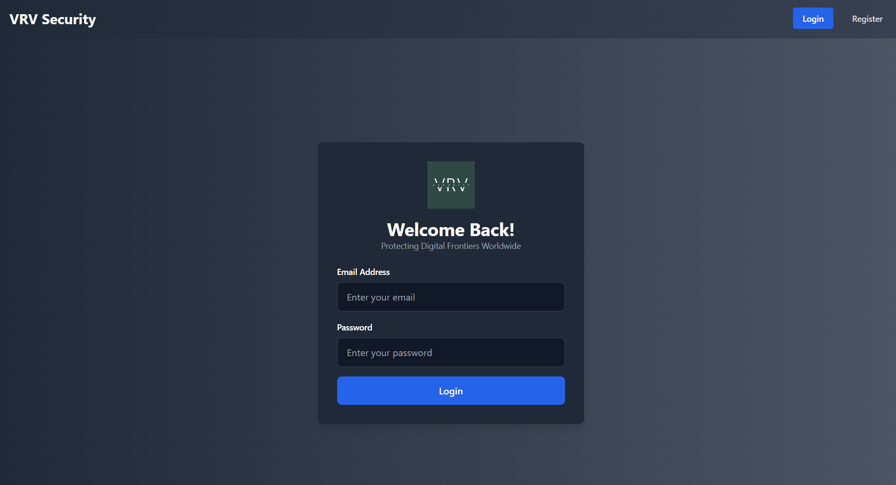
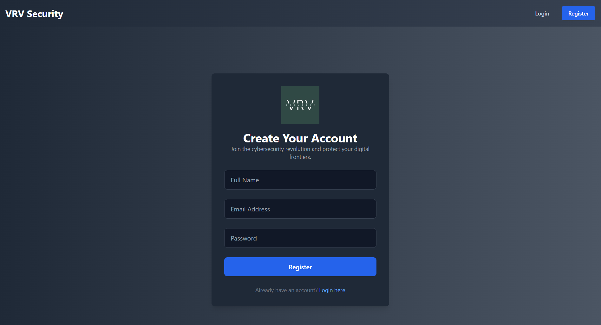
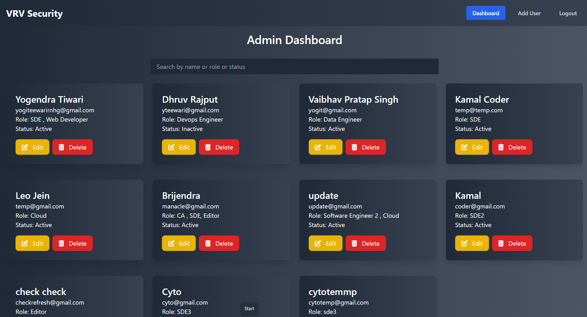
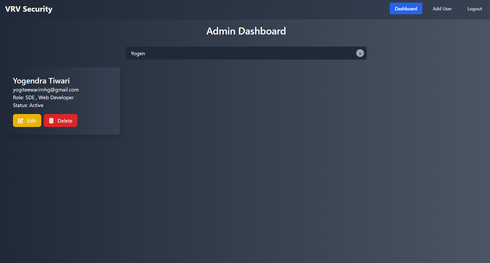
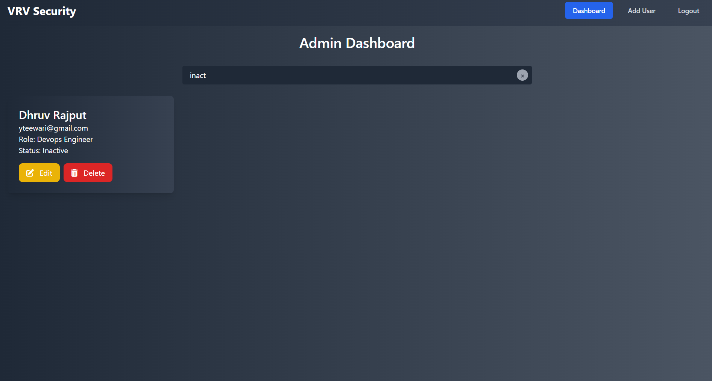
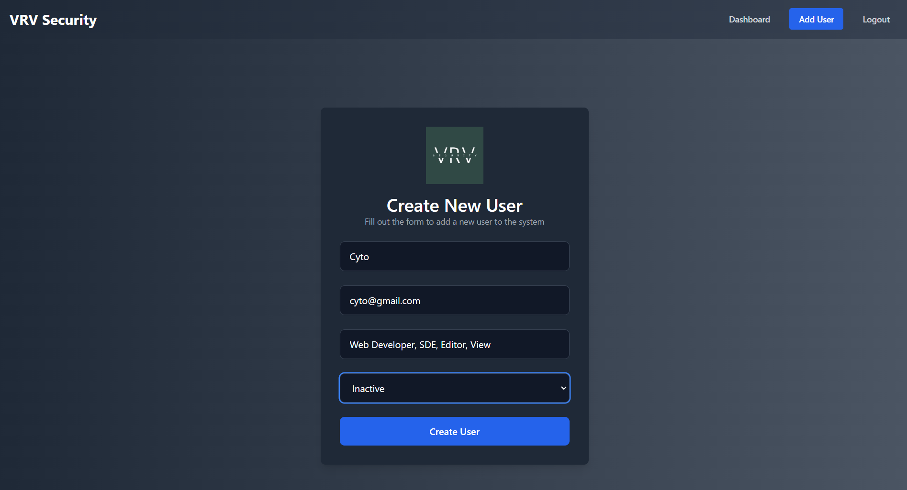
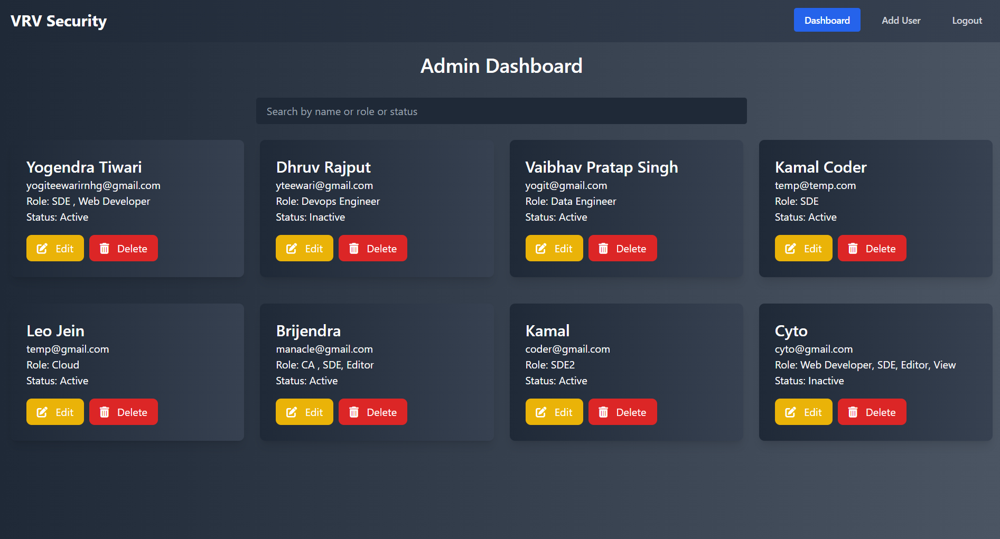
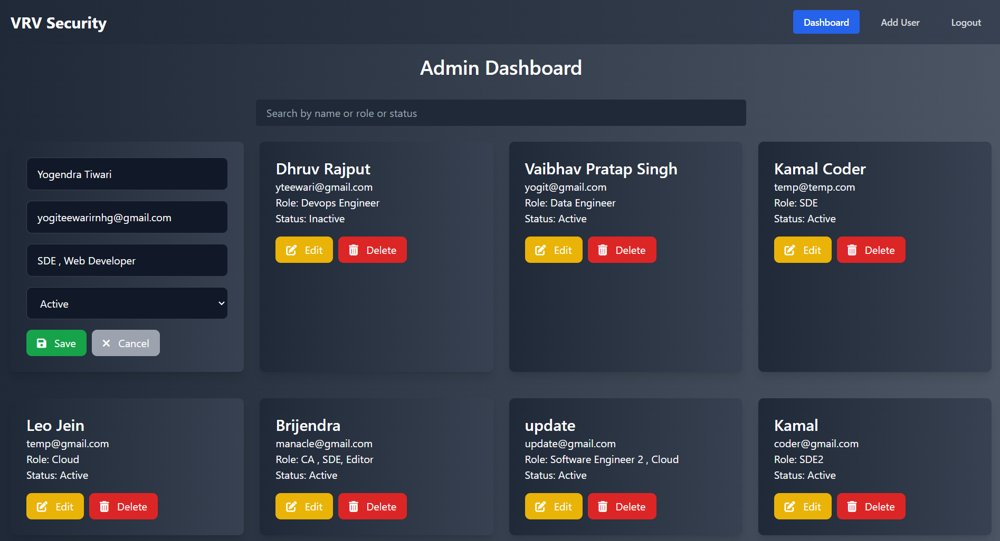
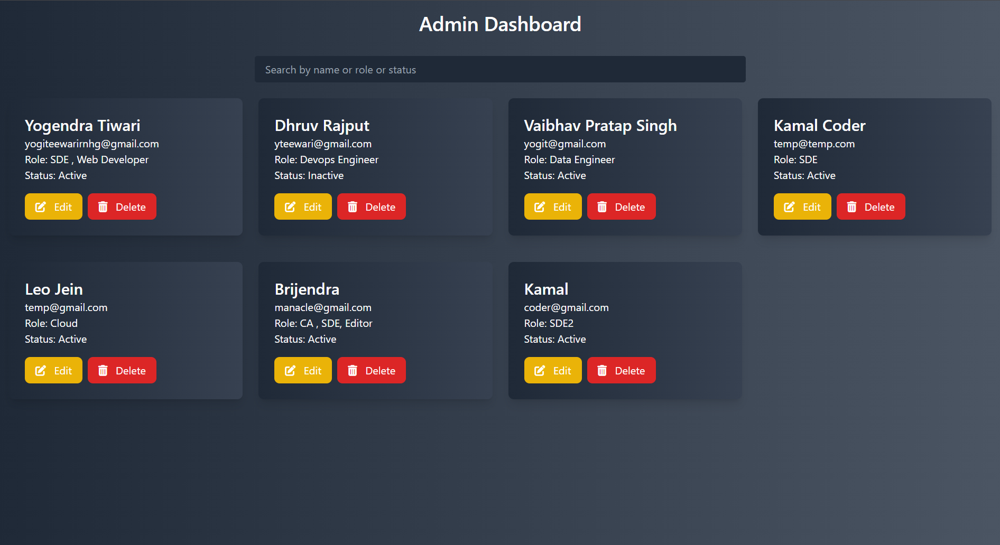

# 🛠️ Admin Dashboard: Streamlining User Management

## 🌟 The Story Behind the Project

In every organization, administrators require a system to manage users effectively. Whether it's creating user accounts, assigning roles, updating information, or deleting obsolete data, the process needs to be efficient, secure, and user-friendly. This project was created to address these needs by building an **RBAC-enabled Admin Dashboard** using modern technologies like **Node.js**, **MongoDB**, **React.js**, and **Tailwind CSS**.

This dashboard empowers administrators to manage users, roles, and permissions with a seamless and intuitive interface, ensuring a secure and efficient user management process.

---

## 🎯 Problem Statement

Organizations often face challenges with:
- **Inefficient User Management**: Manual handling of user data leads to errors and delays.
- **Security Vulnerabilities**: Weak authentication systems can expose sensitive data.
- **Limited Search Functionality**: Finding specific users is difficult without robust filtering options.

---

## 💡 The Solution: Admin Dashboard

This project offers a comprehensive solution with the following features:
- **JWT**-based **user authentication** for secure login and registration.
- **Bcrypt**-hashed passwords for enhanced security.
- A dynamic, responsive UI built with **React.js** and **Tailwind CSS**.
- Robust **MongoDB** integration for secure data storage.
- User-friendly **CRUD operations** for managing users, roles, and statuses.
- Powerful **search functionality** for filtering users based on attributes such as name, role, or status.

---

## 🚀 Features: From Concept to Reality

### 1. **Authentication**
   - Secure login and registration process to ensure data privacy.  
   - **Login Page**  
      
   - **Register Page**  
     

---

### 2. **Dashboard Overview**
   - View and manage all users at a glance, with roles and statuses clearly displayed.  
   

---

### 3. **Search Users**
   - Effortlessly search for users by **name**, **role**, or **status**.  
   - **Search Users By Name**  
     
   - **Search Users By Role**  
     
   - **Search Users By Status**  
     

---

### 4. **User Management**
   - **Creating New Users**: Add users with roles and statuses.  
     
   - **Created New Users**: New user has been added.  
     
   - **Edit Existing Users**: Update user details and profile photos.  
     
   - **Delete Users**: Remove inactive or obsolete users.  
     

---

## 🛠️ Built With

### Backend
- **Node.js** and **Express.js** for server-side logic.
- **MongoDB** for database management.
- **JWT** for authentication.
- **Bcrypt** for password security.

### Frontend
- **React.js** with **Vite** for a fast, dynamic UI.
- **Tailwind CSS** for responsive and flexible styling.

---

## ⚙️ Project Architecture

### Backend: API Endpoints
1. **Authentication**
   - `POST /api/auth/register`: Register a new user.
   - `POST /api/auth/login`: Login a user.

2. **User Management**
   - `GET /api/users`: Retrieve all users.
   - `POST /api/users`: Add a new user.
   - `PUT /api/users/:id`: Update user details.
   - `DELETE /api/users/:id`: Delete a user.

---

### Frontend Workflow
1. **Dynamic Components**: React components dynamically display user data.
2. **Search Functionality**: Filters users based on name, role, or status.
3. **Form Validation**: Ensures clean and accurate data entry.

---

## 🛠️ Setting Up the Project

### Prerequisites
- Install **Node.js** (v16+ recommended).
- Set up **MongoDB** (local or cloud instance).

### Installation

### Backend

1. **Install dependencies**:
    ```bash
    npm install
    ```

2. **Create a `.env` file** with the following variables:
    ```env
    PORT=5000
    MONGO_URI=<your-mongodb-uri>
    JWT_SECRET=<your-secret-key>
    ```

3. **Start the backend server**:
    ```bash
    npm run start
    ```

### Frontend

1. **Navigate to the frontend directory**:
    ```bash
    cd ../frontend
    ```

2. **Install dependencies**:
    ```bash
    npm install
    ```

3. **Start the development server**:
    ```bash
    npm run dev
    ```

---

## 🎨 Visual Showcase: Bringing It All Together

Here’s how the dashboard looks and functions:
- **Login & Registration**: Users can securely log in and register.
- **Dashboard Overview**: Admins can view all users with their respective roles and statuses.
- **Search Functionality**: Filters enable quick searches based on user attributes.
- **User Management**: Admins can add, edit, and delete users as required.

Each step ensures a seamless admin experience.

---

## 📚 Lessons Learned & Future Enhancements

### Lessons Learned
- Building a secure and scalable authentication system.
- Efficiently managing state and user interactions in React.
- Implementing advanced filtering and search features.

### Future Enhancements
- **Role-Based Access Control (RBAC)**: Restrict features based on user roles.
- **Activity Logs**: Track and monitor user actions.
- **Analytics Dashboard**: Add visual insights into user data.

---

## 🤝 Contributing

We welcome contributions! Follow these steps:

1. Fork the repository.
2. Create a feature branch:
    ```bash
    git checkout -b feature-name
    ```
3. Commit and push your changes:
    ```bash
    git commit -m "Add feature-name"
    git push origin feature-name
    ```
4. Open a pull request.

---

## 🙏 Acknowledgments

A huge thanks to:
- **MongoDB**, **Node.js**, and **React.js** for being the backbone of this project.
- **Tailwind CSS** for making styling intuitive and responsive.
- Open-source contributors and the community for invaluable resources.

Let’s build seamless admin experiences together! 🚀
