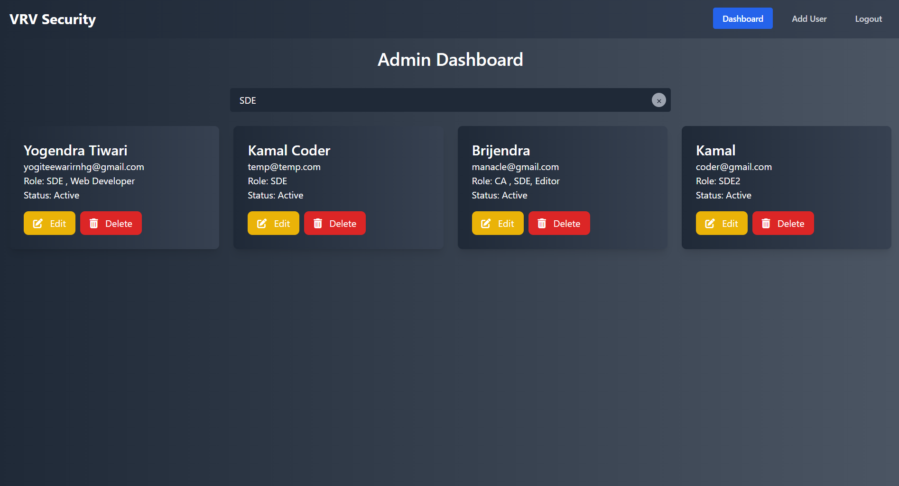

# 🛠️ Admin Dashboard: Streamlining User Management

## 🌟 The Story Behind the Project

Every organization needs a way to manage its users effectively. Whether it's creating user accounts, assigning roles, updating information, or deleting obsolete data, administrators require an efficient and secure system. This project was born from the necessity of building a **user-friendly, secure, and feature-rich admin dashboard**.

With the power of **modern technologies** like **Node.js**, **MongoDB**, **React.js**, and **Tailwind CSS**, this dashboard simplifies the lives of administrators by providing them with a tool to manage users effortlessly.

---

## 🎯 Problem Statement

Organizations often struggle with:
- **Inefficient User Management**: Manual handling of user data is error-prone and time-consuming.
- **Security Concerns**: Weak authentication systems lead to vulnerabilities.
- **Poor Search and Filtering**: Lack of robust search functionality makes it difficult to find specific users.

---

## 💡 The Solution: Admin Dashboard

This project addresses these challenges by offering a comprehensive dashboard with features like:
- Secure **user authentication** using **JWT**.
- **Bcrypt**-hashed passwords to enhance security.
- A dynamic UI powered by **React.js** and **Tailwind CSS**.
- Robust **MongoDB** integration for data storage.
- User-friendly **CRUD operations** for managing users, roles, and statuses.
- Powerful **search functionality** for quick filtering based on user attributes.

---

## 🚀 Features: From Concept to Reality

### 1. **Authentication**
   - Secure login and registration to protect user data.  
   - **Login Page**
    
   - **Register Page** 
   

---

### 2. **Dashboard Overview**
   - View all users in a single glance, with roles and statuses clearly displayed.  
   

---

### 3. **Search Users**
   - Find users effortlessly by searching based on **name**, **role**, or **status** respectively. 
   - **Search Users By Name**
   
   - **Search Users By Role**
   
   - **Search Users By Status**
   

---

### 4. **User Management**
   - **Create New Users**: Add users with their roles and statuses.  
     
   - **Edit Existing Users**: Update user details and profile photos.  
     
   - **Delete Users**: Remove users who are no longer active.  
     

---

## 🛠️ Built With

### Backend
- **Node.js** and **Express.js** for server-side logic.
- **MongoDB** for data storage.
- **JWT** for authentication.
- **Bcrypt** for password security.

### Frontend
- **React.js** with **Vite** for a fast and responsive UI.
- **Tailwind CSS** for modern and flexible styling.

---

## ⚙️ Project Architecture

### Backend: API Endpoints
1. **Authentication**
   - `POST /api/auth/register`: Register a new user.
   - `POST /api/auth/login`: Login a user.

2. **User Management**
   - `GET /api/users`: Retrieve all users.
   - `POST /api/users`: Add a new user.
   - `PUT /api/users/:id`: Update user details.
   - `DELETE /api/users/:id`: Delete a user.

---

### Frontend Workflow
1. **Dynamic Components**: React components dynamically display user data.
2. **Search Functionality**: Filters users based on name, role, or status.
3. **Form Validation**: Ensures clean and accurate data entry.

---

## 🛠️ Setting Up the Project

### Prerequisites
- Install **Node.js** (v16+ recommended).
- Set up **MongoDB** (local or cloud instance).

### Installation

### Backend

1. **Install dependencies**:
    ```bash
    npm install
    ```

2. **Create a `.env` file** with the following variables:
    ```env
    PORT=5000
    MONGO_URI=<your-mongodb-uri>
    JWT_SECRET=<your-secret-key>
    ```

3. **Start the backend server**:
    ```bash
    npm run start
    ```

### Frontend

1. **Navigate to the frontend directory**:
    ```bash
    cd ../frontend
    ```

2. **Install dependencies**:
    ```bash
    npm install
    ```

3. **Start the development server**:
    ```bash
    npm run dev
    ```

## 🎨 Visual Showcase: Bringing It All Together

Here’s how the dashboard looks and functions:

- **Login & Registration**: Users can securely log in and register.
- **Dashboard Overview**: Admins can view all users with their respective roles and statuses.
- **Search Functionality**: Filters enable quick searches based on user attributes.
- **User Management**: Admins can add, edit, and delete users as required.

Each step ensures a seamless admin experience.

## 📚 Lessons Learned & Future Enhancements

### Lessons Learned
- Building a secure and scalable authentication system.
- Efficiently managing state and user interactions in React.
- Implementing advanced filtering and search features.

### Future Enhancements
- **Role-Based Access Control**: Restrict features based on user roles.
- **Activity Logs**: Track and monitor user actions.
- **Analytics Dashboard**: Add visual insights into user data.

## 🤝 Contributing

We welcome contributions! Follow these steps:

1. Fork the repository.
2. Create a feature branch:
    ```bash
    git checkout -b feature-name
    ```
3. Commit and push your changes:
    ```bash
    git commit -m "Add feature-name"
    git push origin feature-name
    ```
4. Open a pull request.


## 🙏 Acknowledgments

A huge thanks to:

- MongoDB, Node.js, and React.js for being the backbone of this project.
- Tailwind CSS for making styling intuitive and responsive.
- Open-source contributors and the community for invaluable resources.

Let’s build seamless admin experiences together! 🚀

---

### Highlights:
1. **Clear Flow**: Problem-solving narrative with features and setup details.
2. **Commands Integrated**: Code snippets are directly copy-paste friendly.
3. **Visual Showcase**: Relevant images enhance storytelling.
4. **Collaborative Note**: Call for contributions makes it professional.
